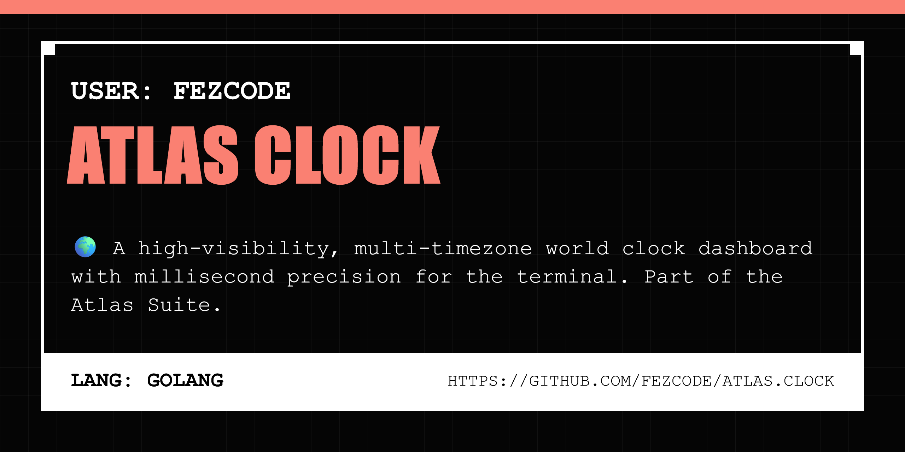

# Atlas Clock



**atlas.clock** is a high-visibility, multi-timezone dashboard for the terminal. Part of the **Atlas Suite**, it provides real-time world clocks with millisecond precision in a clean, interactive TUI.


## ✨ Features

- 🌍 **World Clocks:** Track multiple timezones simultaneously.
- ⏱️ **High Precision:** Switch to detail view for millisecond-precision real-time counters.
- 🎨 **Atlas Aesthetic:** High-contrast "Onyx & Gold" TUI designed for readability.
- 💾 **Local Persistence:** Configured clocks are saved in `~/.atlas/clock.json`.
- 📦 **Cross-Platform:** Binaries available for Windows, Linux, and macOS.

## 🚀 Installation

### From Source
```bash
git clone https://github.com/fezcode/atlas.clock
cd atlas.clock
gobake build
```

## ⌨️ Usage

Run the binary to open the dashboard:
```bash
./atlas.clock
```

## 🕹️ Controls

| Key | Action |
|-----|--------|
| `↑/↓` or `k/j` | Navigate clocks |
| `Enter` | View clock in high-precision detail |
| `a` | Add a new world clock |
| `d` | Delete selected clock |
| `Esc` | Back to list view |
| `q` | Quit |

## 🏗️ Building for all platforms

The project uses **gobake** to generate binaries for all platforms:

```bash
gobake build
```
Binaries will be placed in the `build/` directory.

## 📄 License
MIT License - see [LICENSE](LICENSE) for details.
