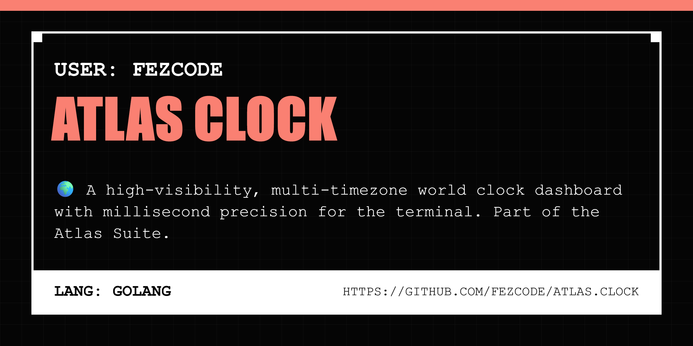

# Atlas Clock



**atlas.clock** is a fast, interactive terminal user interface (TUI) for tracking world timezones on a phosphor-CRT styled dashboard inspired by 1970s engineering workstations.


## ✨ Features

- 🌍 **Multi-Timezone Grid:** Responsive dashboard of live clocks, each with a day/night glyph and UTC offset.
- ⏱️ **High-Precision Detail:** Big phosphor digits and millisecond readout for any selected clock.
- 🧭 **Filterable Zone Picker:** Type to fuzzy-search the ~400+ IANA timezone list during the add flow.
- ↕️ **Reorder In Place:** `SHIFT+arrow` swaps clocks on the grid and persists immediately.
- 🛡️ **Confirmation Flows:** Multi-step confirm for both adding and deleting clocks — no accidental edits.
- 💾 **Local Persistence:** Dashboard state is saved in `~/.atlas/clock.json`.
- 📦 **Cross-Platform:** Binaries available for Windows, Linux, and macOS (AMD64, ARM64).

## 🚀 Installation

### From Source
```bash
git clone https://github.com/fezcode/atlas.clock
cd atlas.clock
go build -o atlas.clock .
```

## ⌨️ Usage

Launch the dashboard:
```bash
atlas.clock
```

### Adding a Clock
1. Press `a`.
2. Type the label (e.g. "Office", "NY Desk").
3. Press `↵`, then type to filter the zone list (e.g. "tokyo").
4. `↵` on the zone, `y` to confirm.

### Deleting a Clock
1. Navigate to the clock with arrow keys.
2. Press `d`, then `y` to confirm.

### Reordering
Hold `SHIFT` with any arrow key to swap the selected clock with its neighbour. Order is saved automatically.

## 🕹️ Controls

| Key | Action |
|-----|--------|
| `↑/↓/←/→` or `h/j/k/l` | Navigate grid |
| `SHIFT+arrow` (or `H/J/K/L`) | Reorder the selected clock |
| `Enter` | Open detail view |
| `a` | Add a new clock |
| `d` | Delete the selected clock (requires `y` to confirm) |
| `Esc` | Back / cancel |
| `q` or `Ctrl+C` | Quit |

## 📂 Storage Location

- **Windows:** `%USERPROFILE%\.atlas\clock.json`
- **Linux/macOS:** `~/.atlas/clock.json`

## 🏗️ Building for all platforms

The project uses **gobake** to generate binaries for all supported platforms:

```bash
gobake build
```
Binaries are placed in the `build/` directory.

## 📄 License
MIT License - see [LICENSE](LICENSE) for details.
